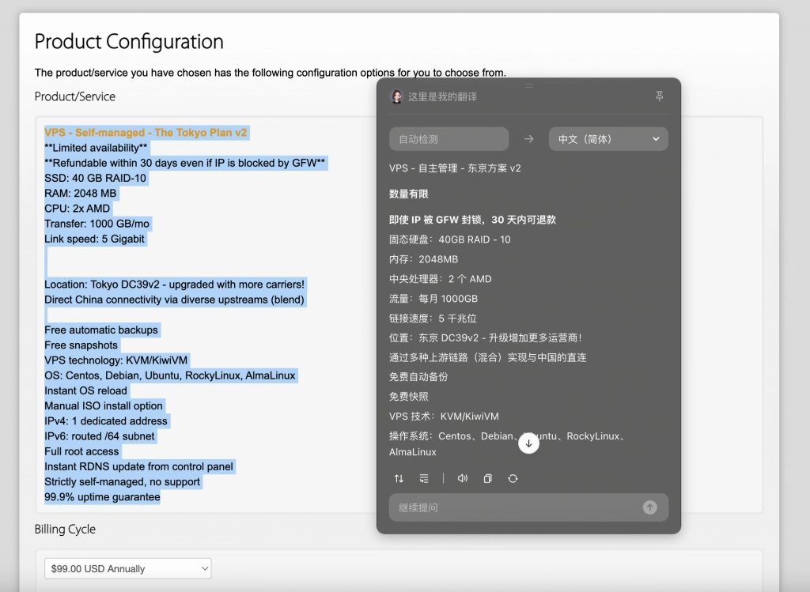
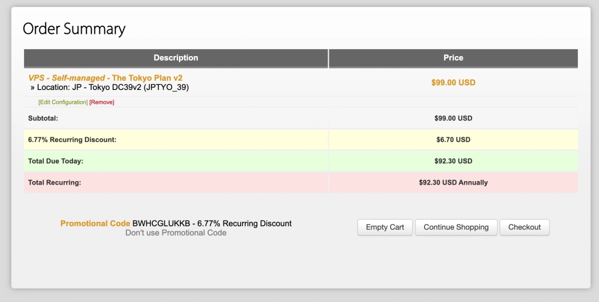

# [Sold Out] BandwagonHost DC39v2 Server: Budget-Friendly Triple Direct Connect, Mixed BGP Routes at $92.3/Year

---

Looking for a Japan VPS that won't break the bank but still delivers solid performance? BandwagonHost's DC39v2 Tokyo node offers triple direct routing with mixed BGP at just $92.3 annually. With 2GB RAM, 1TB monthly bandwidth, and a 30-day money-back guarantee, it's particularly well-suited for mobile network users seeking stable connections to Japan without premium pricing.

---

## What You're Actually Getting

Let's cut through the marketing speak. This is what BandwagonHost's DC39v2 large package delivers:

**Hardware specs:** 2-core AMD EPYC processor, 2GB RAM, 40GB SSD storage  
**Network allocation:** 1000GB monthly bandwidth at 5Gbps port speed  
**Location:** Tokyo DC39v2 data center  
**Annual cost:** $92.3 with promo code

The setup is straightforward—no surprises, no hidden limitations. You get what's listed, and there's a 30-day refund window if you use less than 10% of your bandwidth allocation.

## The Network Reality Check

DC39v2 runs triple direct connections with mixed BGP routing. The default fallback is China Mobile International (CMI).

Here's how it actually performs across different carriers:

**Mobile users** see the best results—low latency, solid bandwidth, consistent performance. If you're on China Mobile, this is your sweet spot.

**China Unicom and Telecom users** get decent connections during off-peak hours. Prime time (evenings, weekends) can bring some slowdowns and latency bumps due to cross-carrier routing. Your mileage varies based on local network conditions.

Before committing to a full year, you might want to explore whether 👉 [BandwagonHost's network architecture suits your specific carrier setup](https://bandwagonhost.com/aff.php?aff=79616). Their triple direct routing works particularly well for mobile users, but understanding your own network environment helps set realistic expectations.

## Purchase Details

Use promo code **BWHCGLUKKB** at checkout to lock in the $92.3/year rate.

**Important notes:**
- Register a new account to ensure full refund eligibility
- Refund requires less than 10% total bandwidth usage
- 30-day money-back window from purchase date

## How It Stacks Up

Let's compare apples to apples in the Japan VPS market:

**BandwagonHost DC39v2 base plan** ($73.65/year): 1 core, 1GB RAM, 500GB bandwidth. The resource allocation feels cramped for the price—you're better off jumping to the large package.

**DMIT Japan** (starting at $155/year): 1 core, 1GB RAM, 450GB bandwidth. Premium CN2 routing delivers excellent performance, but you're paying double for that guarantee. Worth it if network quality trumps budget concerns.

**BandwagonHost DC39v2 large plan** ($92.3/year): Hits the middle ground—reasonable resources, reliable mobile network performance, refund protection. It's not the cheapest option, nor the most premium, but the balance works for most users.

For mobile network users seeking predictable Japan connectivity without premium pricing, the DC39v2 large package makes practical sense. If you're looking for flexibility beyond a single provider, consider checking out 👉 [BandwagonHost's data center options across Asia-Pacific regions](https://bandwagonhost.com/aff.php?aff=79616) to find the best fit for your routing needs.

## Before You Buy

**New account setup recommended** for full refund coverage

**Monitor your bandwidth** if you plan to test during the refund window—stay under 10% total usage

**Mobile network users** will see the most consistent performance with DC39v2's routing setup

**China Unicom/Telecom users** should test during peak hours to gauge real-world performance before committing long-term

---

## Bottom Line

BandwagonHost's DC39v2 large package delivers what it promises: stable triple direct routing to Japan at a mid-tier price point. It's not flashy, not revolutionary—just a solid, functional VPS that works particularly well for mobile network users. At $92.3/year with a 30-day safety net, it's a reasonable choice for users who value predictable performance over rock-bottom pricing or premium guarantees. The refund window gives you a month to verify it matches your specific network environment, which beats most alternatives in this price range.
